所有的项目都基于idea gradle + Spring-boot 来开发构建

---

# code/demo 项目

* spring-boot 

* MySQL, MyBatis, mybatis Generator

* 一个工程(project), 一个模块(module)

* 数据库连接池默认, junit测试可用, 项目运行可用


项目目录如下，基本包括数据层，service层，control层

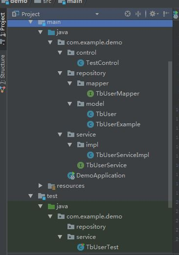

mybatisGenerator生成运行(**注意源码中查看Gradle中的mybatisGenerator任务部分的写法**)

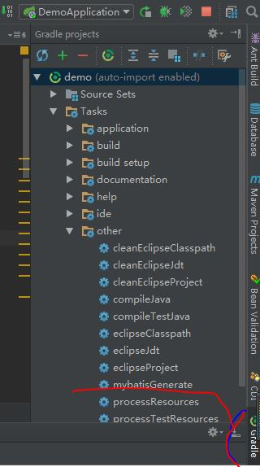

junit 测试

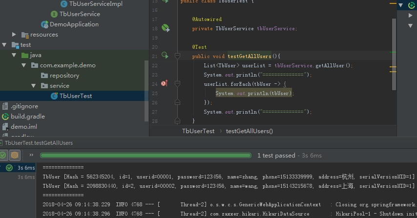

Chrome装一个Rest Client插件，运行截图


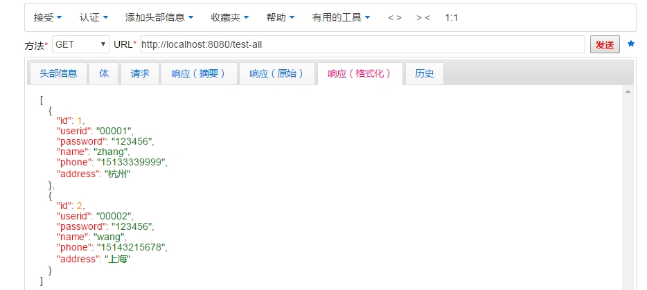


主要参考如下：(读者还是直接clone代码，对比看，运行比较好)

1. 余生五月.利用SpringBoot、Gradle、IDEA进行SSM框架搭建（基础篇）[E/OL]http://97uncle.cn/?p=64

2. Inke.springboot-gradle + mybatis-generator-plugin[E/OL]https://blog.csdn.net/inke88/article/details/74766432

3. wkCaesar.idea gradle之mybatis-generator使用[E/OL]https://blog.csdn.net/qq_36666651/article/details/79560228

百度搜索出来的问题：(建议google，文章只能参考，不要照着抄来做项目)

1. 大部分基于maven，而非gradle

2. 用了 mybatis 而没有用 mybatis generator 自动生成

3. 配置文件不清楚, 包括 application.properties(or application.yml),Application类里面的注解配置，连接池配置（用的什么）

4. 陈旧的类，配置还是基于古老的spring-boot,还有一些xml文件(spring-boot 是来简化工作的，跟spring一样进行配置是没有必要的)

5. 不给出完整的代码和截图（写文章就写好，不然就是废物，浪费资源）

6. 测试基本没写（test目录要么没有，要么实际有，却不给出配置或运行截图，问题同上）

---

# code/demo2 项目

在demo项目的基础上加上日志处理

* Slf4j + logback（日志处理的种类很多，本次选用的是常用的 slf4j + logback）

* logback.xml 的配置

* 日志输出到控制台 和  文件中（当然日志输出是多样的，还可以使用第三方获取实时产生的日志）

注意：

1. build.gradle中的依赖添加

2. logback-spring.xml的编写（具体需要参考logback官网）

3. **项目运行仍存在一些 debug 日志没有处理 Todo**


日志的控制台输出和文件输出

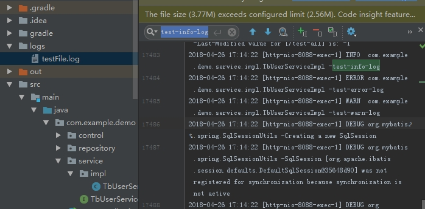

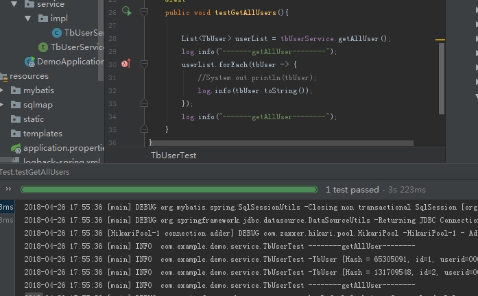

参考

1. logback官网.The logback manual[E/OL]https://logback.qos.ch/manual/index.html

2. aubdiy.logback.xml常用配置详解[E/OL]http://aub.iteye.com/blog/1110008

---

# code/demo3 项目

* 一个工程(project), 多个模块(module)，主要是如下的三层

1. demo-repo : mybatis generator 生成

2. demo-service : 数据库服务层

3. demo-api : control层 提供api

gradle注意项目的依赖关系

----

# jacoco 自动化测试 (demo2)

[用Gradle构建Spring Boot项目](https://www.cnblogs.com/davenkin/p/gradle-spring-boot.html)

```
apply plugin: 'jacoco'

jacoco{
	toolVersion = "0.8.1"
	reportsDir = file("$buildDir/customJacocoReportDir")
}

jacocoTestReport {
	reports {
		xml.enabled false
		html.enabled true
	}
}

check.dependsOn jacocoTestReport
```

相关的运行命令（直接在demo2目录下）

```bash
$ gradle clean test

$ bash gredlew build

$ bash gradlew jacocoTestReport
```


* Test

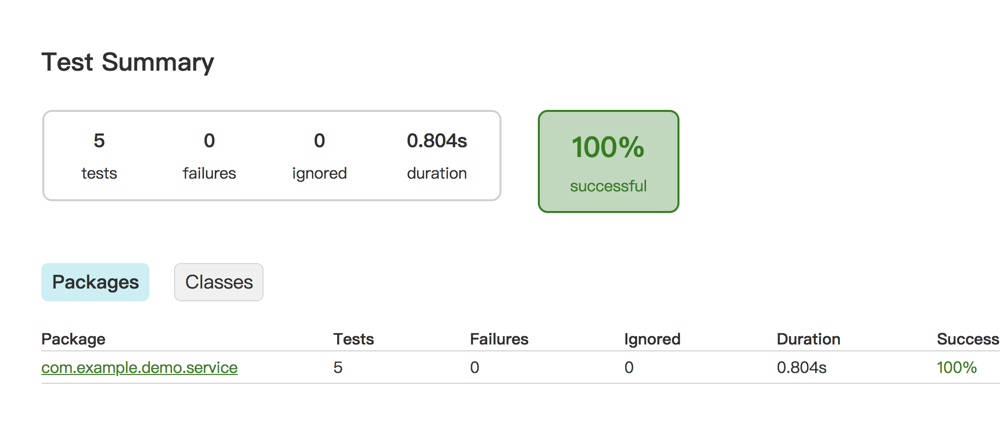

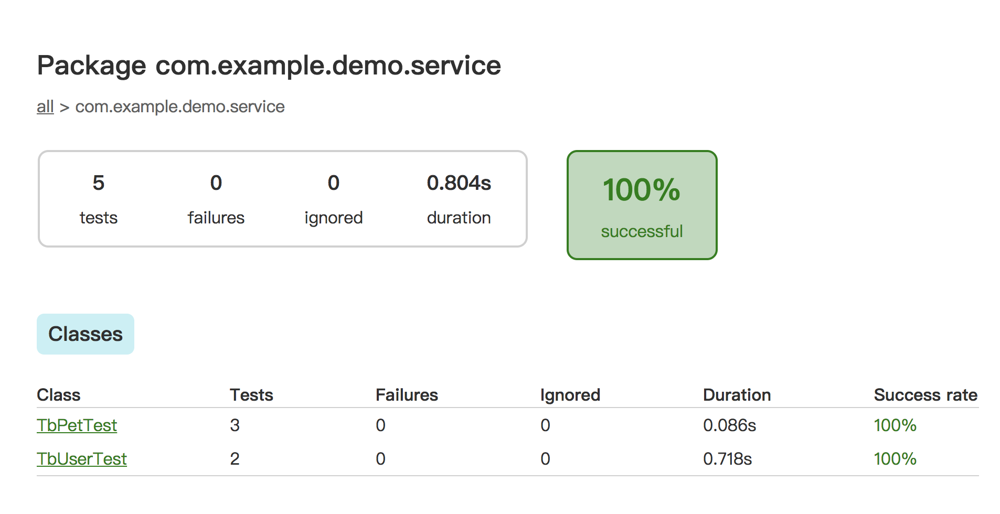

* jacoco

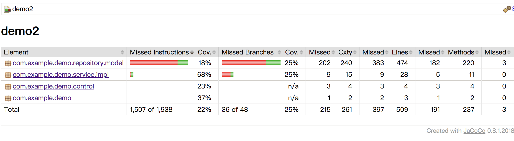

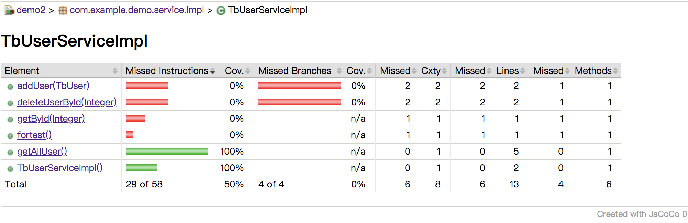


# spring-boot 接入kafka(demo2)

<a href="https://github.com/doctording/spring-boot-demos/commit/2bf044a3005e940f1b4e517fb16c74ea57e370f8" target="_blank">点击查看接入过程</a>

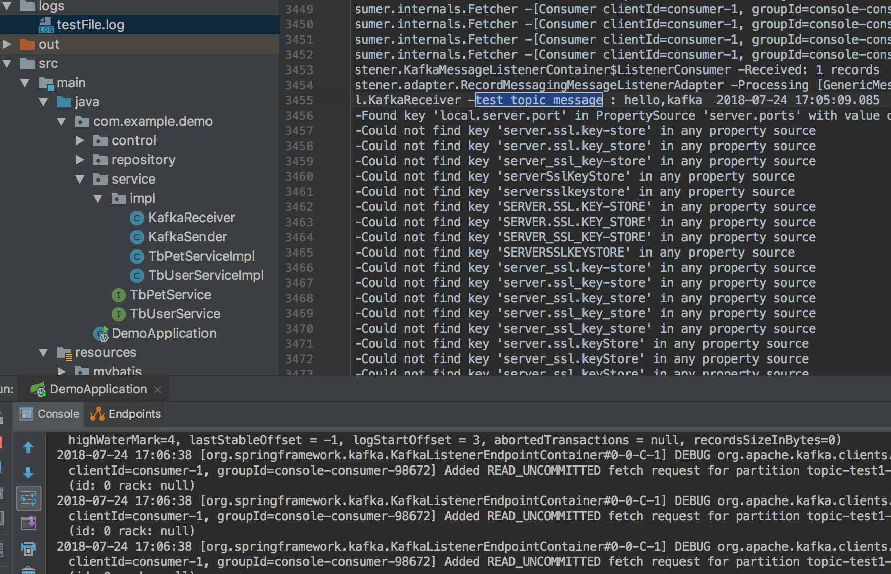

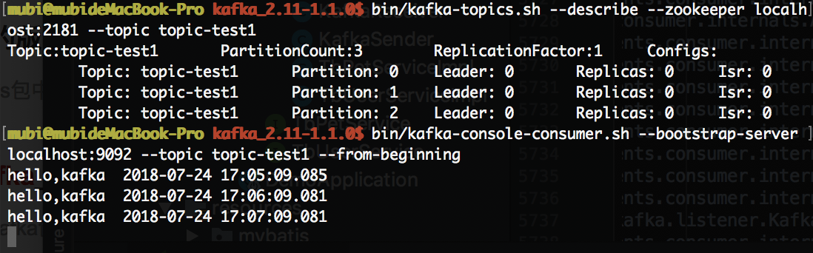

* 参考

[spring boot + kafka 使用详细步骤](https://blog.csdn.net/lcj_star/article/details/77337640)

[SpringBoot Kafka 整合使用](https://blog.csdn.net/tzs_1041218129/article/details/78988439)

# TODO