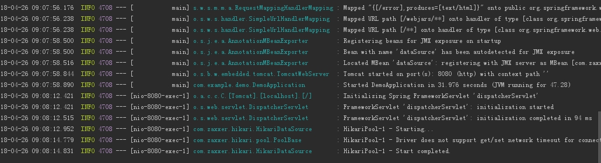

所有的项目都基于idea gradle 来开发构建

---

# code/demo项目

* spring-boot 

* MySQL, MyBatis, mybatis Generator

* 一个工程(project), 一个模块(module)

* 数据库连接池默认, junit测试可用, 项目运行可用

项目目录如下，基本包括数据层，service层，control层

mybatisGenerator生成运行(**注意源码中查看Gradle中的mybatisGenerator任务部分的写法**)

junit 测试

Chrome装一个Rest Client插件，运行截图

主要参考如下：(读者还是直接clone代码，对比看，运行比较好)

1. 余生五月.利用SpringBoot、Gradle、IDEA进行SSM框架搭建（基础篇）[E/OL]http://97uncle.cn/?p=64

2. Inke.springboot-gradle + mybatis-generator-plugin[E/OL]https://blog.csdn.net/inke88/article/details/74766432

3.wkCaesar.idea gradle之mybatis-generator使用[E/OL]https://blog.csdn.net/qq_36666651/article/details/79560228

百度搜索出来的问题：(建议google，文章只能参考，不要照着抄来做项目)

1. 大部分基于maven，而非gradle

2. 用了 mybatis 而没有用 mybatis generator 自动生成

3. 配置文件不清楚, 包括 application.properties(or application.yml),Application类里面的注解配置，连接池配置（用的什么）

4. 陈旧的类，配置还是基于古老的spring-boot,还有一些xml文件(spring-boot 是来简化工作的，跟spring一样进行配置是没有必要的)

5. 不给出完整的代码和截图（写文章就写好，不然就是废物，浪费资源）

6. 测试基本没写（test目录要么没有，要么实际有，却不给出配置或运行截图，问题同上）

---

# 
