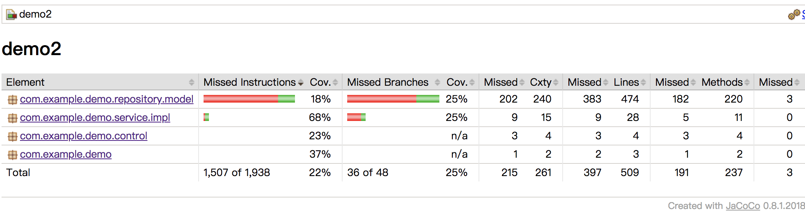
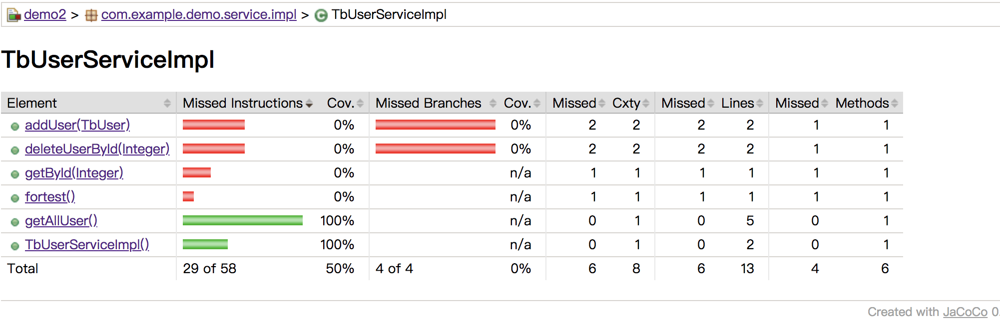
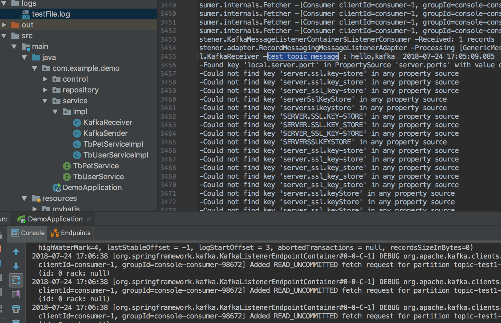

# code/demo3 项目

## 项目结构

* 一个工程(project), 多个模块(module)，主要是如下的三层

1. demo-repo : mybatis generator 生成

2. demo-service : 数据库服务层

3. demo-api : control层 提供api

gradle注意项目的依赖关系

## jacoco 自动化测试 (demo2)

[用Gradle构建Spring Boot项目](https://www.cnblogs.com/davenkin/p/gradle-spring-boot.html)

```java
apply plugin: 'jacoco'

jacoco{
	toolVersion = "0.8.1"
	reportsDir = file("$buildDir/customJacocoReportDir")
}

jacocoTestReport {
	reports {
		xml.enabled false
		html.enabled true
	}
}

check.dependsOn jacocoTestReport
```

相关的运行命令（直接在demo2目录下）

```bash
$ gradle clean test

$ bash gredlew build

$ bash gradlew jacocoTestReport
```

* Test


* jacoco





## spring-boot 接入kafka(demo2)

<a href="https://github.com/doctording/spring-boot-demos/commit/2bf044a3005e940f1b4e517fb16c74ea57e370f8" target="_blank">点击查看接入过程</a>




* 参考

[spring boot + kafka 使用详细步骤](https://blog.csdn.net/lcj_star/article/details/77337640)

[SpringBoot Kafka 整合使用](https://blog.csdn.net/tzs_1041218129/article/details/78988439)

## Springboot + MockMvc 测试 Controller层 (demo项目)

```java
==============

MockHttpServletRequest:
      HTTP Method = GET
      Request URI = /test
       Parameters = {}
          Headers = {Content-Type=[application/json;charset=UTF-8], Accept=[application/json]}
             Body = null
    Session Attrs = {}

Handler:
             Type = com.example.demo.control.TestControl
           Method = public java.lang.String com.example.demo.control.TestControl.getTest() throws java.lang.Exception

Async:
    Async started = false
     Async result = null

Resolved Exception:
             Type = null

ModelAndView:
        View name = null
             View = null
            Model = null

FlashMap:
       Attributes = null

MockHttpServletResponse:
           Status = 200
    Error message = null
          Headers = {Content-Type=[application/json;charset=UTF-8], Content-Length=[10]}
     Content type = application/json;charset=UTF-8
             Body = hello test
    Forwarded URL = null
   Redirected URL = null
          Cookies = []
org.springframework.mock.web.MockHttpServletResponse@29eda4f8
==============
2018-07-29 23:51:43.323  INFO 41374 --- [       Thread-3] o.s.w.c.s.GenericWebApplicationContext   : Closing org.springframework.web.context.support.GenericWebApplicationContext@2d901eb0: startup date [Sun Jul 29 23:51:40 CST 2018]; root of context hierarchy

Process finished with exit code 0

```
